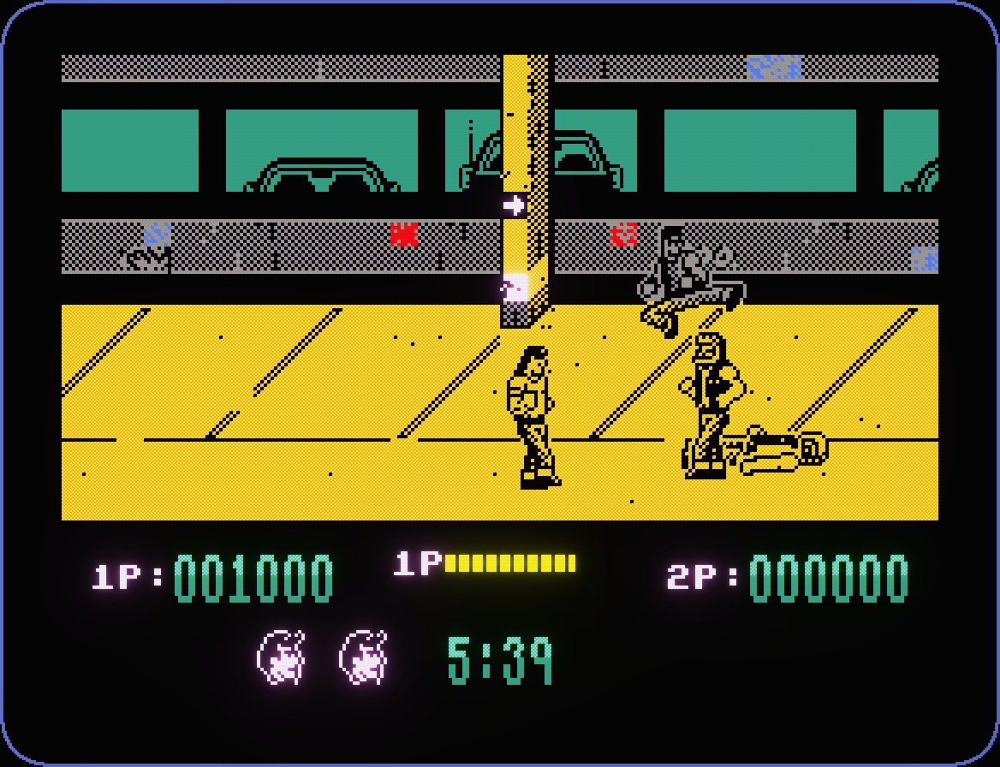
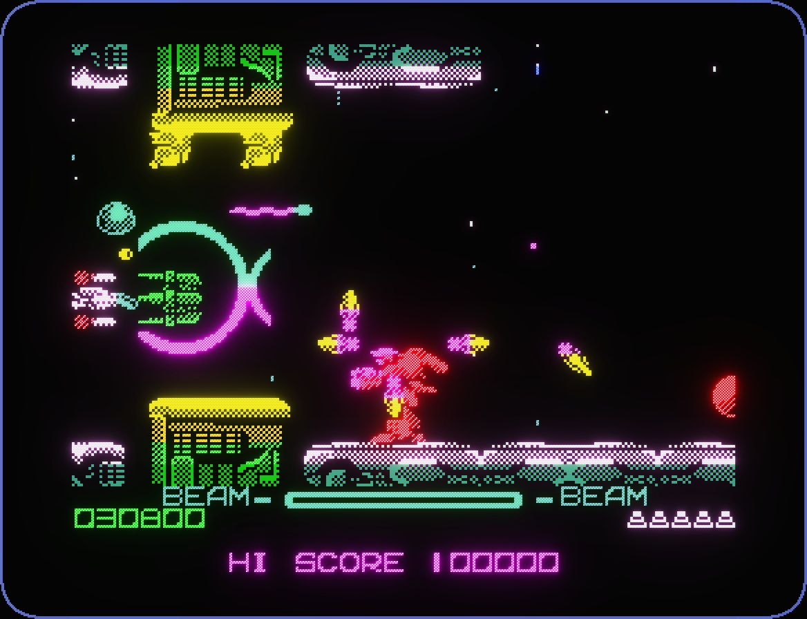
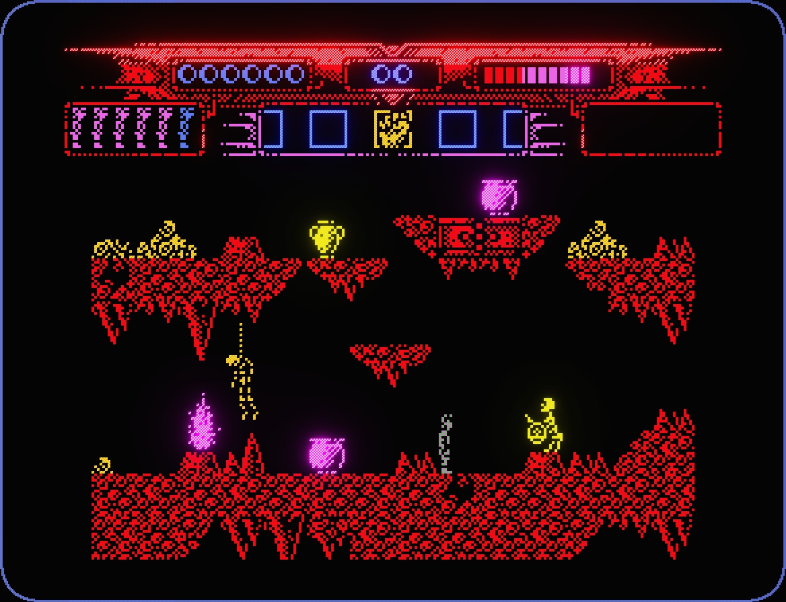
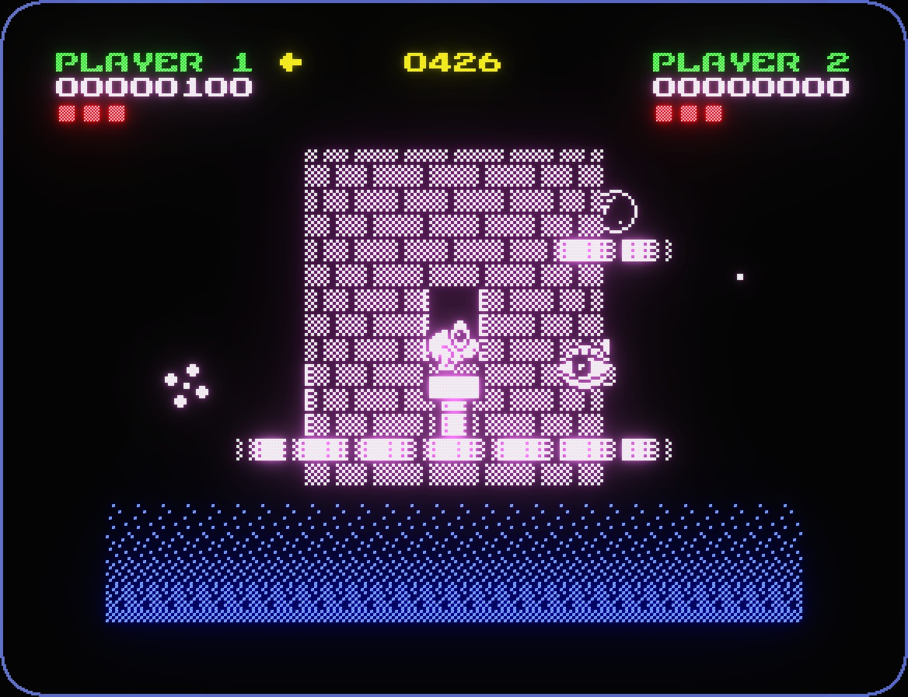
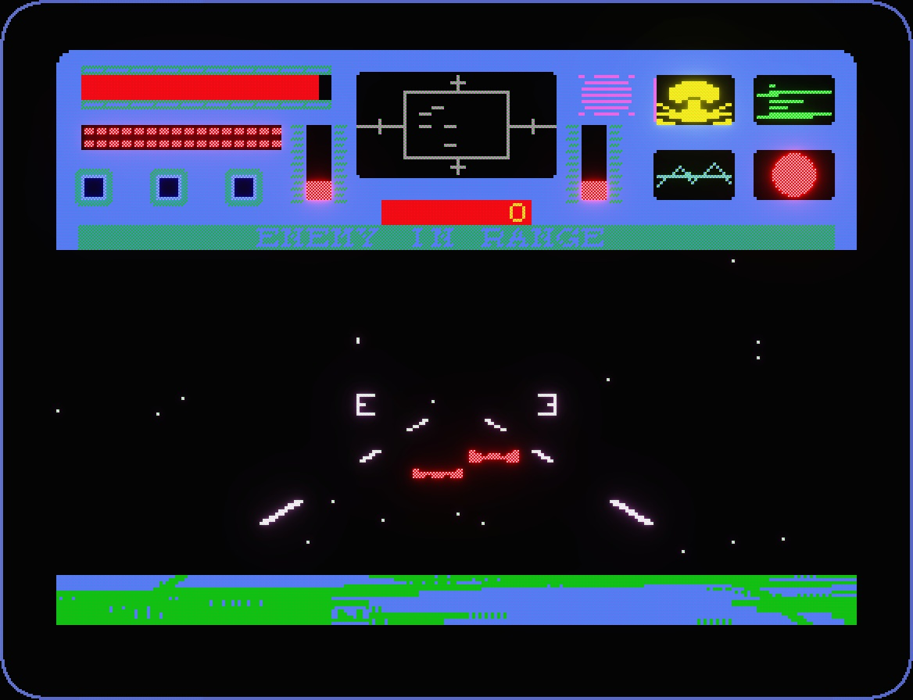
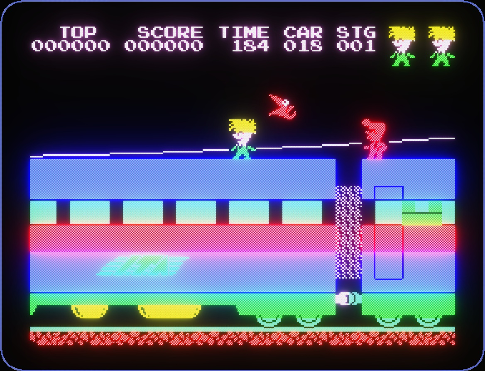

# <a href="../README.md"></a> ZX Spectrum на Стрелочках
<sub>[](https://store.steampowered.com/app/4210250/Logic_Arrows/)</sub>
&nbsp;&nbsp;&nbsp;
🌐 [English](../README.md) | Русский

Эмулятор ZX Spectrum’а — легендарного домашнего компьютера 1980-х. Работает в режиме реального
времени внутри программируемого клеточного автомата
[«Стрелочки»](https://store.steampowered.com/app/4210250/Logic_Arrows/). Эмулятор запускает
настоящие спектрумовские игры прямо на карте: экран, память, клавиатура и даже звук — всё сделано из
стрелочек. Проект написан для новой версии Стрелочек, которая сейчас проходит бета-тестирование и
готовится к выходу в Steam.
[Добавьте Стрелочки в список желаемого](https://store.steampowered.com/app/4210250/Logic_Arrows/),
чтобы не пропустить релиз.

- [Игры](#games)
- [Как устроено](#how-it-works)
- [Сборка и тесты](#build)
- [Ссылки](#links)
<br><br>


## <a name="games"></a>Игры

<table>
  <tr>
    <td valign="top" width="50%">
      <h3>Target: Renegade</h3>
      
    </td>
    <td valign="top">
      <h3>R-Type</h3>
      
    </td>
  </tr>
  <tr>
    <td valign="top">
      <h3>Myth: History in the Making</h3>
      
    </td>
    <td valign="top">
      <h3>Nebulus</h3>
      
    </td>
  </tr>
  <tr>
    <td valign="top">
      <h3>Star Raiders II</h3>
      
    </td>
    <td valign="top">
      <h3>Stop the Express</h3>
      
    </td>
  </tr>
</table>
<br><br>


## <a name="how-it-works"></a>Как устроено

Эмулятор написан на TypeScript и компилируется в код для внутриигровых командных блоков. Для запуска
игры достаточно пяти блоков: процессор, инициализатор ROM и три блока со снапшотом RAM.

- **Процессор.** Полный набор инструкций Z80, включая недокументированные инструкции и флаги.
  Корректность проверяется тестами эмулятора
  [FUSE](https://fuse-emulator.sourceforge.net/): проходят все 1356 тестов — как на исходном
  TypeScript-коде, так и на финальной упакованной сборке. Тайминги точны до такта: 69888 тактов
  на кадр, 50 кадров в секунду.
- **Скорость.** Эмулятор работает в реальном времени. Есть два дополнительных режима: пошаговый и
  без ограничений.
- **Память.** Состоит из ROM 16 КБ и RAM 48 КБ. Вся память видна на экране целиком, до последнего
  бита, и меняется прямо на глазах: можно вживую наблюдать, как работает стек, как обновляются
  буферы, как подготавливаются спрайты, прежде чем проступить на экране.
- **Экран.** 256×192 пикселя, бордюр и атрибуты FLASH. Область дисплея синхронизируется с картой
  построчно, вслед за лучом — как на настоящем телевизоре.
- **Клавиатура.** Матрица 8×5 полурядов спектрумовской клавиатуры читается прямо из сигналов на
  карте.
- **Звук.** Бипер транслируется в музыкальные стрелочки игры.
- **Упаковка.** Сборочный конвейер сжимает весь процессор в один командный блок объёмом около
  24 000 символов: esbuild → собственный инлайнер функций → три прохода Terser → преобразование
  в стрелочные функции → самораспаковывающаяся строка.
- **Игры.** Игры загружаются из снапшотов `.z80`. Каждый снапшот пакуется в три командных
  блока — по 16К RAM в каждом — плюс регистры процессора и цвет бордюра.
<br><br>


## <a name="build"></a>Сборка и тесты

```sh
npm install
npm run build
npm test
```

Требуется Node.js 22.6 или новее. Сборка автоматически скачивает оригинальный ROM и файлы
тестов FUSE, проверяя их SHA256. Игры собираются из снапшотов `.z80`, положенных в папку
`resources/` (в репозиторий они не входят). Результат попадает в `dist/`: упакованный процессор,
инициализатор ROM и три блока RAM на игру — готовые ко вставке в командные блоки на карте.
`npm run dev` пересобирает только процессор.
<br><br>


## <a name="links"></a>Ссылки

- [Стрелочки в Steam](https://store.steampowered.com/app/4210250/Logic_Arrows/) – будущая версия
  игры, сейчас в бета-тестировании
- [Стрелочки в браузере](https://logic-arrows.io/) – браузерная версия игры
- [Карты в Стрелочках](https://github.com/chubrik/LogicArrows/blob/main/ru/README.md) – коллекция
  карт: компьютеры, программы и документация
- [Компилятор Стрелочек](https://github.com/chubrik/arrows-compiler/blob/main/ru/README.md) –
  онлайн-компилятор для внутриигровых компьютеров
- [Дискорд-сервер](https://discord.gg/8FMuQuMFCN) – сообщество игроков на Дискорде
- [Телеграм-канал](https://t.me/logic_arrows) – сообщество игроков в Телеграме
